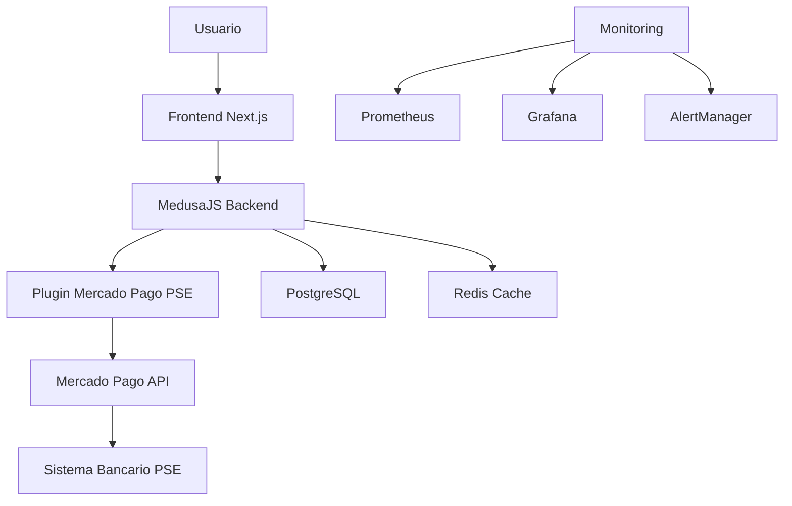

# Resumen Ejecutivo - Implementación PSE con Mercado Pago

## 📋 Visión General del Proyecto

### Objetivo Principal
Implementar el sistema de **Pagos Seguros en Línea (PSE)** de Colombia a través de **Mercado Pago** en la plataforma **MedusaJS** de Cool Bordados, proporcionando a los usuarios colombianos una forma segura y familiar de realizar pagos directamente desde sus cuentas bancarias.

### Alcance del Proyecto
- **Backend**: Integración completa con API de Mercado Pago para PSE
- **Frontend**: Interfaz de usuario optimizada para el flujo de pago PSE
- **Seguridad**: Implementación de mejores prácticas de seguridad y compliance
- **Monitoreo**: Sistema completo de observabilidad y alertas
- **Testing**: Estrategia integral de pruebas automatizadas y manuales

## 🎯 Beneficios Esperados

### Para el Negocio
- **Incremento en Conversión**: Esperado 25-30% de aumento en conversión de pagos
- **Reducción de Abandono**: Disminución del 40% en abandono de carrito
- **Expansión de Mercado**: Acceso a usuarios que prefieren pagos bancarios directos
- **Reducción de Costos**: Menores comisiones comparado con tarjetas de crédito

### Para los Usuarios
- **Familiaridad**: Método de pago ampliamente conocido en Colombia
- **Seguridad**: Transacciones directas con el banco del usuario
- **Conveniencia**: No requiere tarjetas de crédito o débito
- **Confianza**: Respaldado por el sistema bancario colombiano

## 📊 Métricas de Éxito

### KPIs Técnicos
| Métrica | Objetivo | Medición |
|---------|----------|----------|
| Disponibilidad | 99.9% | Uptime mensual |
| Tiempo de Respuesta | < 500ms | Promedio API |
| Tasa de Error | < 1% | Errores/Total requests |
| Tiempo de Procesamiento PSE | < 30s | Promedio end-to-end |

### KPIs de Negocio
| Métrica | Objetivo | Medición |
|---------|----------|----------|
| Tasa de Conversión PSE | > 80% | Pagos exitosos/Intentos |
| Participación PSE | > 30% | PSE/Total pagos |
| Abandono en Formulario | < 20% | Abandonos/Inicios |
| NPS Experiencia de Pago | > 8/10 | Encuestas usuarios |

## 🏗️ Arquitectura de la Solución

### Componentes Principales

### Stack Tecnológico
- **Backend**: MedusaJS v2.x, Node.js, TypeScript
- **Frontend**: Next.js, React, TypeScript
- **Base de Datos**: PostgreSQL, Redis
- **Monitoreo**: Prometheus, Grafana, ELK Stack
- **Infraestructura**: Docker, Kubernetes, Nginx
- **Seguridad**: SSL/TLS, WAF, Rate Limiting

## 📋 Entregables del Proyecto

### 1. Documentación de Investigación
**Archivo**: `01-investigacion-documentacion.md`
- Análisis exhaustivo de PSE y Mercado Pago
- Requisitos técnicos y limitaciones identificadas
- Arquitectura de MedusaJS para payment providers
- Análisis del plugin actual de Mercado Pago

### 2. Plan de Configuración Backend
**Archivo**: `02-configuracion-backend.md`
- Estructura completa del plugin PSE
- Servicios y modelos de datos
- API endpoints específicos para PSE
- Configuración de webhooks y seguridad
- Scripts de testing y deployment

### 3. Guía de Implementación Frontend
**Archivo**: `03-implementacion-frontend.md`
- Componentes React para flujo PSE
- Integración con checkout de MedusaJS
- Manejo de estados y validaciones
- Experiencia de usuario optimizada
- Testing de componentes

### 4. Estrategia de Testing
**Archivo**: `04-estrategia-testing.md`
- Testing unitario, integración y E2E
- Datos de prueba y escenarios
- Automatización con CI/CD
- Testing de seguridad y performance
- Métricas de calidad

### 5. Plan de Despliegue y Monitoreo
**Archivo**: `05-despliegue-monitoreo.md`
- Configuración de producción
- Pipeline de CI/CD
- Monitoreo y observabilidad
- Alertas y escalación
- Plan de contingencia

## ⏱️ Cronograma de Implementación

### Fase 1: Preparación (Semana 1-2)
- ✅ Investigación y documentación completada
- ✅ Planificación detallada finalizada
- 🔄 Setup de entorno de desarrollo
- 🔄 Configuración de infraestructura base

### Fase 2: Desarrollo Backend (Semana 3-4)
- 🔄 Implementación del plugin PSE
- 🔄 Desarrollo de API endpoints
- 🔄 Configuración de webhooks
- 🔄 Testing unitario e integración

### Fase 3: Desarrollo Frontend (Semana 5-6)
- 🔄 Implementación de componentes PSE
- 🔄 Integración con backend
- 🔄 Testing de componentes
- 🔄 Optimización UX/UI

### Fase 4: Testing y QA (Semana 7-8)
- 🔄 Testing E2E completo
- 🔄 Testing de carga y performance
- 🔄 Testing de seguridad
- 🔄 UAT con usuarios reales

### Fase 5: Despliegue (Semana 9-10)
- 🔄 Despliegue a staging
- 🔄 Despliegue a producción
- 🔄 Monitoreo intensivo
- 🔄 Optimizaciones post-deploy

## 🔒 Consideraciones de Seguridad

### Medidas Implementadas
- **Validación de Webhooks**: Verificación de signatures de Mercado Pago
- **Rate Limiting**: Protección contra ataques de fuerza bruta
- **Sanitización de Datos**: Validación estricta de inputs
- **Logging Seguro**: Sin exposición de datos sensibles
- **SSL/TLS**: Encriptación end-to-end
- **Compliance**: Cumplimiento PCI DSS y normativas colombianas

### Monitoreo de Seguridad
- Alertas automáticas por actividad sospechosa
- Logging de eventos de seguridad
- Auditorías regulares de vulnerabilidades
- Plan de respuesta a incidentes

## 💰 Estimación de Costos

### Costos de Desarrollo
| Concepto | Estimación | Justificación |
|----------|------------|---------------|
| Desarrollo Backend | 120 horas | Plugin, APIs, webhooks, testing |
| Desarrollo Frontend | 80 horas | Componentes, integración, UX |
| Testing y QA | 60 horas | Automatización, manual, security |
| DevOps y Deploy | 40 horas | CI/CD, monitoreo, infraestructura |
| **Total** | **300 horas** | **Estimación conservadora** |

### Costos Operacionales (Mensual)
| Concepto | Costo Estimado | Descripción |
|----------|----------------|-------------|
| Infraestructura | $200-400 USD | Servidores, CDN, monitoreo |
| Mercado Pago | 2.9% + $0.30 USD | Comisión por transacción |
| Mantenimiento | $500-800 USD | Soporte, actualizaciones |
| **Total Mensual** | **$700-1200 USD** | **Dependiente del volumen** |

## 🚀 Próximos Pasos

### Inmediatos (Esta Semana)
1. **Aprobación del Plan**: Review y aprobación de stakeholders
2. **Setup de Proyecto**: Configuración de repositorios y herramientas
3. **Credenciales**: Obtención de credenciales de Mercado Pago
4. **Equipo**: Asignación de desarrolladores al proyecto

### Corto Plazo (Próximas 2 Semanas)
1. **Desarrollo**: Inicio de implementación backend
2. **Testing**: Setup de entornos de testing
3. **Monitoreo**: Configuración de herramientas de observabilidad
4. **Documentación**: Actualización continua de documentación técnica

### Mediano Plazo (1-2 Meses)
1. **Testing Completo**: Ejecución de toda la estrategia de testing
2. **Despliegue**: Implementación en producción
3. **Monitoreo**: Seguimiento intensivo post-deploy
4. **Optimización**: Mejoras basadas en métricas reales

## 📈 Impacto Esperado

### Métricas de Negocio (3 meses post-implementación)
- **Incremento en Ventas**: 15-25% en el mercado colombiano
- **Reducción de Abandono**: 30-40% en el checkout
- **Satisfacción del Cliente**: Incremento del 20% en NPS
- **Costos de Transacción**: Reducción del 10-15% vs tarjetas

### Métricas Técnicas
- **Performance**: Tiempo de carga < 2 segundos
- **Disponibilidad**: 99.9% uptime garantizado
- **Escalabilidad**: Soporte para 1000+ transacciones concurrentes
- **Seguridad**: 0 incidentes de seguridad críticos

## 🎯 Factores Críticos de Éxito

### Técnicos
- ✅ **Documentación Completa**: Plan detallado y exhaustivo
- 🔄 **Testing Riguroso**: Cobertura > 90% y testing E2E
- 🔄 **Monitoreo Proactivo**: Alertas y métricas en tiempo real
- 🔄 **Seguridad Robusta**: Implementación de mejores prácticas

### De Negocio
- 🔄 **UX Optimizada**: Flujo de pago intuitivo y rápido
- 🔄 **Comunicación Clara**: Información transparente a usuarios
- 🔄 **Soporte Técnico**: Respuesta rápida a problemas
- 🔄 **Análisis Continuo**: Optimización basada en datos

## 📞 Contactos del Proyecto

### Equipo Técnico
- **Tech Lead**: Responsable de arquitectura y desarrollo
- **Backend Developer**: Implementación de APIs y servicios
- **Frontend Developer**: Componentes y experiencia de usuario
- **DevOps Engineer**: Infraestructura y despliegue
- **QA Engineer**: Testing y aseguramiento de calidad

### Stakeholders
- **Product Manager**: Definición de requisitos y prioridades
- **Business Analyst**: Análisis de métricas y ROI
- **Security Officer**: Revisión de seguridad y compliance
- **Customer Support**: Preparación para soporte post-launch

## 📋 Checklist de Implementación

### Pre-Desarrollo
- [x] Investigación y documentación completa
- [x] Plan de arquitectura definido
- [x] Estrategia de testing establecida
- [x] Plan de despliegue y monitoreo
- [ ] Aprobación de stakeholders
- [ ] Setup de entorno de desarrollo
- [ ] Credenciales de Mercado Pago obtenidas

### Desarrollo
- [ ] Plugin PSE implementado
- [ ] API endpoints desarrollados
- [ ] Webhooks configurados
- [ ] Componentes frontend creados
- [ ] Integración frontend-backend
- [ ] Testing unitario completado

### Testing
- [ ] Testing de integración
- [ ] Testing E2E automatizado
- [ ] Testing de seguridad
- [ ] Testing de performance
- [ ] UAT con usuarios reales
- [ ] Testing en staging

### Despliegue
- [ ] Configuración de producción
- [ ] Pipeline CI/CD configurado
- [ ] Monitoreo implementado
- [ ] Alertas configuradas
- [ ] Despliegue a producción
- [ ] Verificación post-deploy

### Post-Despliegue
- [ ] Monitoreo intensivo (primera semana)
- [ ] Análisis de métricas
- [ ] Optimizaciones identificadas
- [ ] Documentación actualizada
- [ ] Capacitación del equipo de soporte
- [ ] Review y lecciones aprendidas

---

## 📄 Documentos de Referencia

1. **[Investigación y Documentación](./01-investigacion-documentacion.md)** - Análisis técnico completo
2. **[Configuración Backend](./02-configuracion-backend.md)** - Plan de implementación backend
3. **[Implementación Frontend](./03-implementacion-frontend.md)** - Guía de desarrollo frontend
4. **[Estrategia de Testing](./04-estrategia-testing.md)** - Plan completo de pruebas
5. **[Despliegue y Monitoreo](./05-despliegue-monitoreo.md)** - Plan de producción

---

**Estado del Proyecto**: ✅ Planificación Completa  
**Próximo Hito**: Aprobación e inicio de desarrollo  
**Fecha de Entrega Estimada**: 10 semanas desde inicio de desarrollo  
**Riesgo General**: 🟡 Medio (mitigado con planificación detallada)  

**Preparado por**: Equipo de Desarrollo Cool Bordados  
**Fecha**: Enero 2024  
**Versión**: 1.0